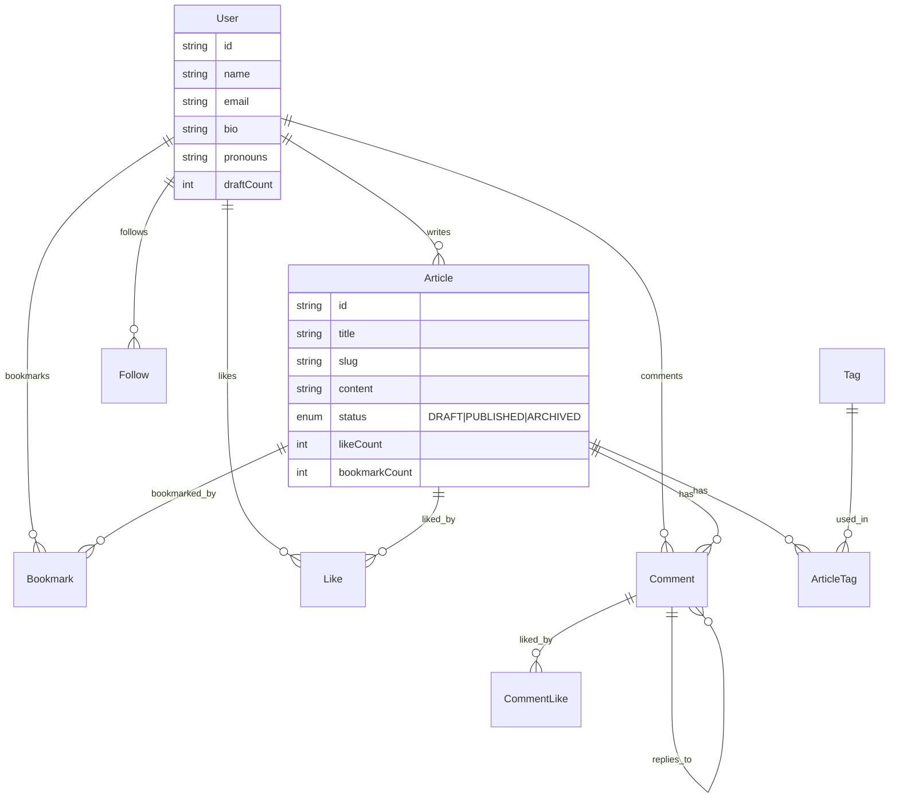

# Cedium

> 一个现代化的创作平台，为写作者而生。

[](LICENSE) [](CONTRIBUTING.md) [](https://tanstack.com/start) [](https://react.dev) [](https://typescriptlang.org) [](https://tailwindcss.com) [](https://prisma.io)

<p align="center">
  <a href="https://cedium.inari-jinja.org" target="_blank">🌐 在线演示</a> •
  <a href="#核心功能">核心功能</a> •
  <a href="#技术栈">技术栈</a> •
  <a href="#快速开始">快速开始</a> •
  <a href="#项目结构">项目结构</a> •
  <a href="#贡献">贡献</a>
</p>

---

## 核心功能

### 📝 内容创作

| 功能 | 说明 |
|------|------|
| **富文本编辑** | Tiptap 编辑器，支持 Markdown、代码高亮、表格、图片 |
| **草稿管理** | DRAFT / PUBLISHED / ARCHIVED 三种状态 |
| **标签系统** | 文章分类与标签关联 |
| **封面设置** | 自定义文章封面图片 |

### 👤 用户系统

| 功能 | 说明 |
|------|------|
| **双重认证** | Email + OTP 验证登录 |
| **个人主页** | 用户资料、bio、pronouns 展示 |
| **头像托管** | Cloudflare R2 云存储 |
| **邮箱验证** | 发布文章前需验证邮箱 |

### 🌐 社交互动

| 功能 | 说明 |
|------|------|
| **关注系统** | 关注/取消关注作者 |
| **文章点赞** | 点赞计数实时更新 |
| **收藏文章** | 个人收藏列表管理 |
| **嵌套评论** | 支持评论回复，评论点赞 |

### 🎨 界面体验

| 功能 | 说明 |
|------|------|
| **深色模式** | 自动跟随系统 + 手动切换 |
| **响应式布局** | 移动端适配，侧边栏收缩 |
| **无限滚动** | TanStack Virtual 虚拟列表 |
| **流畅动画** | Framer Motion 页面过渡 |

---

## 技术栈

| 类别 | 技术 | 版本 |
|:-----|:-----|:----:|
| **框架** | [TanStack Start](https://tanstack.com/start) | latest |
| **路由** | [TanStack Router](https://tanstack.com/router) | latest |
| **数据** | [TanStack Query](https://tanstack.com/query) | latest |
| **表单** | [TanStack Form](https://tanstack.com/form) + Zod | latest |
| **虚拟列表** | [TanStack Virtual](https://tanstack.com/virtual) | v3 |
| **React** | React + React Compiler | v19 |
| **状态** | Jotai | v2 |
| **动画** | Framer Motion | v12 |
| **数据库** | Prisma + PostgreSQL | v7 |
| **认证** | [Better Auth](https://better-auth.com) | v1.5 |
| **样式** | Tailwind CSS v4 + Shadcn/UI | v4 |
| **编辑器** | Tiptap (minimal-tiptap) | v3 |
| **邮件** | Resend | v6 |
| **存储** | Cloudflare R2 | - |
| **测试** | Vitest | v4 |

---

## 快速开始

### 前置要求

- Node.js 18+
- pnpm 8+
- PostgreSQL 15+

### 安装

```bash
# 克隆仓库
git clone https://github.com/Rinisnotarobot/cedium.git

# 安装依赖
pnpm install

# 配置环境变量
cp .env.example .env.local
```

### 环境变量

| 变量 | 必需 | 说明 |
|------|:----:|------|
| `DATABASE_URL` | ✓ | PostgreSQL 连接字符串 |
| `BETTER_AUTH_SECRET` | ✓ | Auth 密钥（`npx @better-auth/cli secret` 生成） |
| `BETTER_AUTH_URL` | ✓ | 服务 URL（开发: `http://localhost:3000`） |
| `R2_ENDPOINT` | ✓ | Cloudflare R2 端点 |
| `R2_ACCESS_KEY_ID` | ✓ | R2 访问密钥 ID |
| `R2_SECRET_ACCESS_KEY` | ✓ | R2 访问密钥 |
| `R2_BUCKET_NAME` | ✓ | 存储桶名称 |
| `R2_PUBLIC_URL` | ✓ | 公开访问 URL |
| `RESEND_API_KEY` | ✓ | Resend 邮件 API |

### 启动

```bash
# 初始化数据库
pnpm db:generate && pnpm db:push

# 开发模式 (端口 3000)
pnpm dev
```

访问 http://localhost:3000 开始探索。

---

## 项目结构

```
src/
├── components/         # UI 组件
│   ├── articles/       # 文章列表、详情、卡片
│   ├── auth/           # 登录表单、OTP 验证
│   ├── comments/       # 嵌套评论系统
│   ├── editor/         # 编辑器相关
│   ├── favorites/      # 收藏列表
│   ├── home/           # 首页组件
│   ├── layout/         # AppSidebar、导航栏
│   ├── settings/       # 设置页面
│   ├── theme/          # 深色模式切换
│   ├── users/          # 用户主页
│   └── ui/             # Shadcn/UI + minimal-tiptap
├── data/               # Server Functions
│   ├── articles.ts     # 文章 CRUD
│   ├── bookmark.ts     # 收藏操作
│   ├── comment.ts      # 评论系统
│   ├── follow.ts       # 关注关系
│   ├── like.ts         # 点赞功能
│   └── tags.ts         # 标签管理
├── hooks/              # 自定义 Hooks
│   ├── keys/           # Query Keys
│   ├── mutations/      # TanStack Query mutations
│   ├── queries/        # TanStack Query queries
│   └── utils/          # useDebounce, useMobile 等
├── lib/                # 核心配置
│   ├── auth.ts         # Better Auth 服务端
│   ├── auth-client.ts  # Better Auth 客户端
│   ├── auth-guards.ts  # 认证守卫
│   ├── email.ts        # Resend 邮件服务
│   ├── r2.ts           # R2 存储操作
│   └── validators/     # Zod schemas
├── routes/             # 文件路由
│   ├── _app/           # 认证路由组
│   │   ├── me/         # 个人中心
│   │   │   ├── settings/  # 设置页
│   │   │   ├── articles/  # 我的文章
│   │   │   └── favorites/ # 我的收藏
│   │   ├── articles/   # 文章列表/详情
│   │   ├── users/      # 用户主页
│   │   ├── search/     # 文章搜索
│   │   └── write/      # 写作页面
│   ├── _auth/          # 未认证路由
│   │   ├── login/      # 登录
│   │   ├── sign-up/    # 注册
│   │   └── forgot-password/  # 密码重置
│   └── api/auth/       # Better Auth API
├── types/              # TypeScript 类型
├── generated/prisma/   # Prisma 生成的类型
└── styles.css          # 全局样式
```

---

## 数据模型



---

## 常用命令

| 命令 | 说明 |
|------|------|
| `pnpm dev` | 开发服务器 (端口 3000) |
| `pnpm build` | 生产构建 |
| `pnpm start` | 启动生产服务器 |
| `pnpm test` | 运行 Vitest 测试 |
| `pnpm db:generate` | 生成 Prisma Client |
| `pnpm db:push` | 推送数据库结构（开发） |
| `pnpm db:migrate` | 创建迁移（生产） |
| `pnpm db:studio` | 打开 Prisma Studio |
| `pnpm db:seed` | 填充种子数据 |

---

## 路由一览

| 路径 | 页面 | 认证 |
|------|------|:----:|
| `/` | 首页 | ✗ |
| `/about` | 关于页面 | ✗ |
| `/login` | 登录 | ✗ |
| `/sign-up` | 注册 | ✗ |
| `/search` | 文章搜索 | ✓ |
| `/write` | 写作编辑器 | ✓ |
| `/articles` | 文章列表 | ✓ |
| `/articles/:slug` | 文章详情 | ✓ |
| `/users/:username` | 用户主页 | ✓ |
| `/me` | 个人中心 | ✓ |
| `/me/articles` | 我的文章 | ✓ |
| `/me/favorites` | 我的收藏 | ✓ |
| `/me/settings` | 设置中心 | ✓ |

---

## 贡献

我们欢迎所有形式的贡献！

📖 查看 [CONTRIBUTING.md](CONTRIBUTING.md) 了解开发规范。

📋 查看 [CHANGELOG.md](CHANGELOG.md) 了解版本历史。

---

## License

[MIT](LICENSE) © 2026 Rinisnotarobot

---

<p align="center">
  如果这个项目对你有帮助，欢迎给一个 ⭐️
</p>